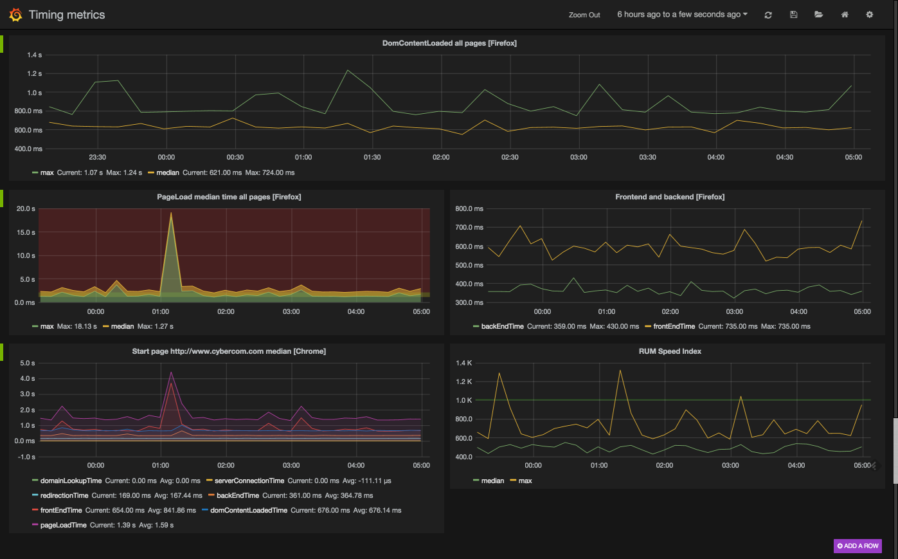

[Documentation](/documentation/) / Graphs

# Graphs
{:.no_toc}

* Lets place the TOC here
{:toc}

The easiest way to graph your data (and keep track how you are doing over time), is sending the data to [Graphite](http://graphite.wikidot.com/). And then use a tool to create the graphs. I like [Grafana](http://grafana.org/) because it is super simple and look nice. Here's how you do it:

* Install Graphite - if you are on Mac OS X and want to test it out, use a Vagrant setup.
* Install Grafana - either by Vagrant or just download and install InfluxDb & ElasticSearch
* Send the data from sitespeed.io to Graphite
* Create the graphs in Grafana. We will soonish add a video of how to do it.

Here are a couple of examples of what ut can look like. Here we test one site, something like this:

~~~bash
sitespeed.io -u http://www.cybercom.com --graphiteHost localhost -m 5 --graphiteNamespace cybercom -b chrome -n 11
~~~

And setup the following graphs:

{: .img-thumbnail}

{: .img-thumbnail}

{: .img-thumbnail}

In this example, we compare four Swedish newspapers, running it like this

~~~bash
$ sitespeed.io  --sites /Users/peter/swedish.txt --graphiteHost localhost --graphiteNamespace newspapers -b chrome -n 7
~~~

and the result:

{: .img-thumbnail}

And the last example, we fetch data from WebPageTest and create the following:

{: .img-thumbnail}

~~~bash
$ sitespeed.io -u http://www.cybercom.com  --wptHost www.webpagetest.org --wptKey MY_SECRET_API_KEY --graphiteHost localhost --graphiteNamespace wpt
~~~

If you send all the metrics and don't need the other output (HTML/JSON, it can be quite extensive if you run it often), put all the output in **/tmp** with the **r** switch like this **-r /tmp**.
{: .note .note-info}

  Doesn't all values reach Graphite (are you missing values), then you should check your **carbon.conf** file.
  The configuration **MAX_CREATES_PER_MINUTE** needs to be set to high (we have seen that 50 is too low). To make sure it works, set it like this:

~~~
MAX_CREATES_PER_MINUTE = inf
~~~

{: .note .note-warning}
