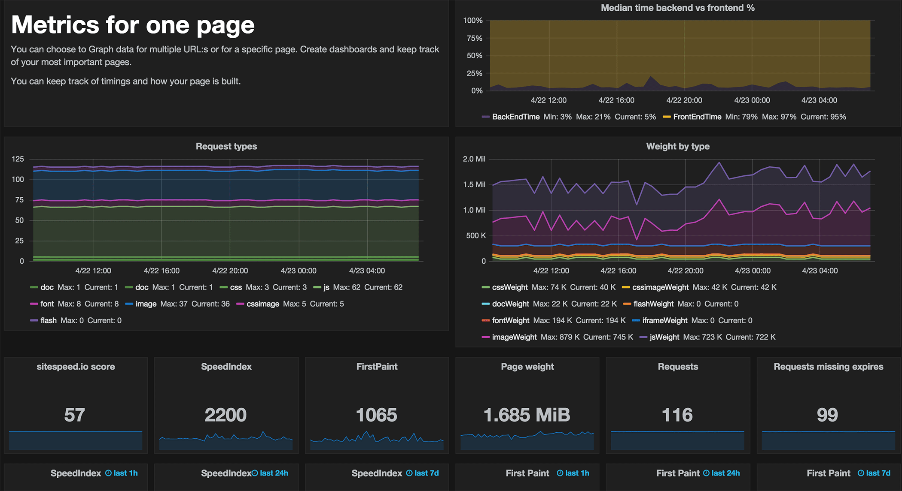
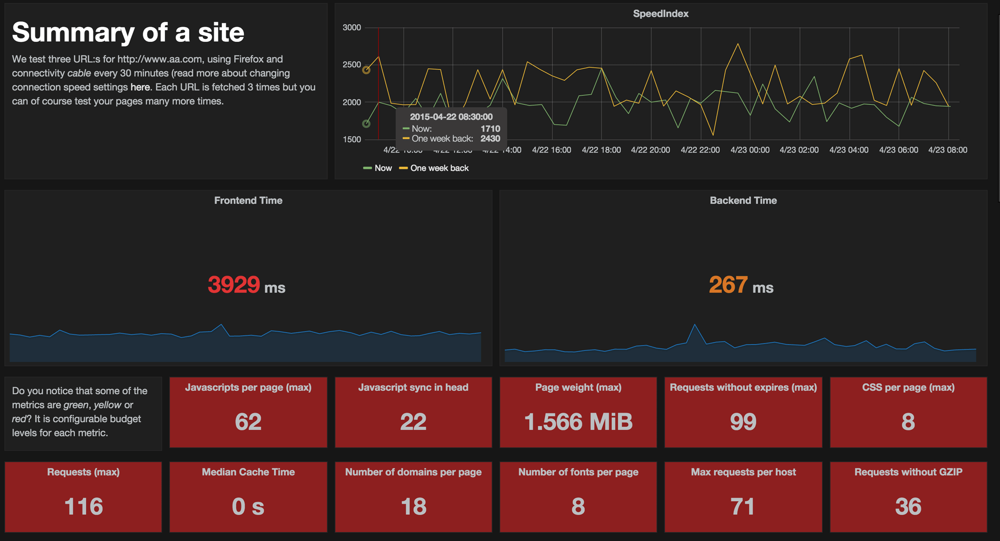
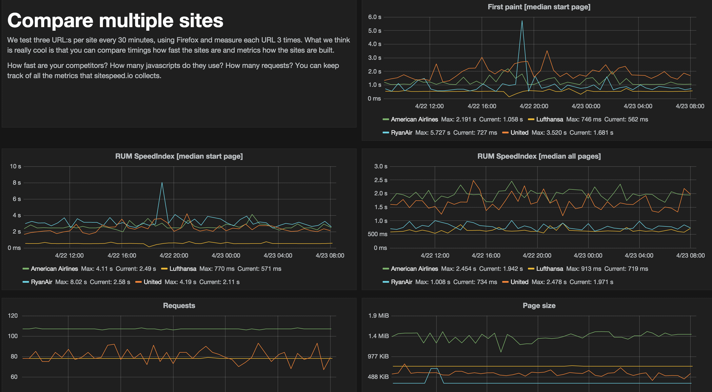
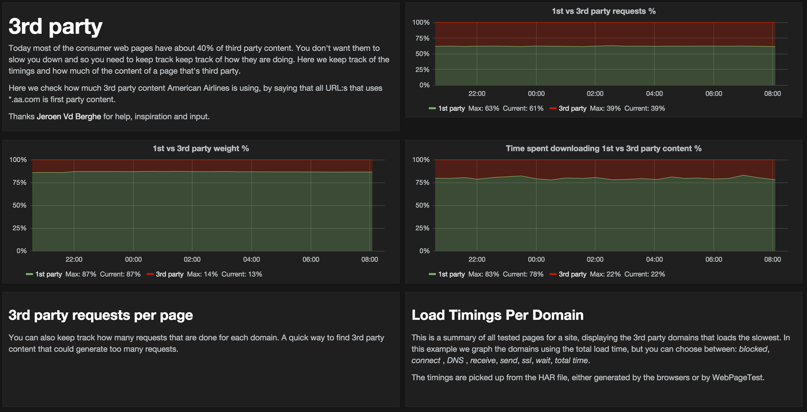
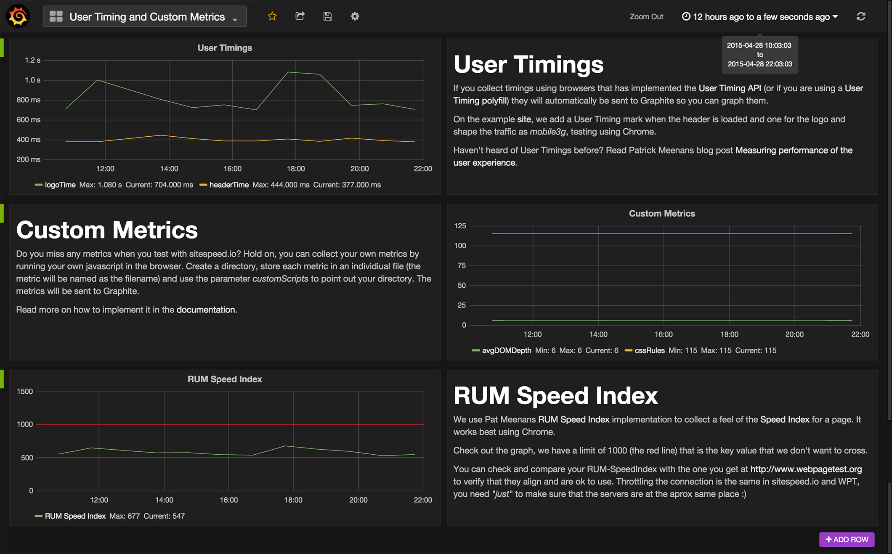
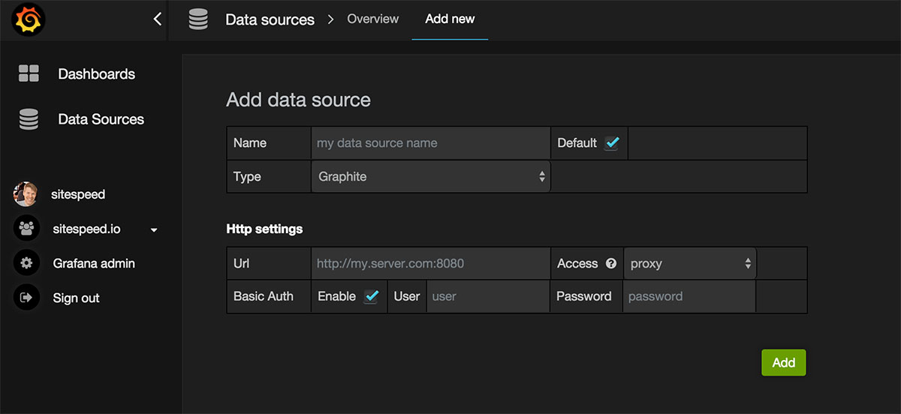

# Performance Dashboard
{:.no_toc}

* Lets place the TOC here
{:toc}

## Background
We have put a lot of love into making it easy to create your own performance dashboard. To get it up and running you need [Docker](https://www.docker.com/). That's it :)

The base is the Docker images:

  * To collect metrics, use one of the three images: [sitespeed.io with Chrome, Firefox & Xvfb](https://hub.docker.com/r/sitespeedio/sitespeed.io/), [sitespeed.io with Chrome & Xvfb](https://hub.docker.com/r/sitespeedio/sitespeed.io-chrome/) or [sitespeed.io with Firefox & Xvfb](https://hub.docker.com/r/sitespeedio/sitespeed.io-firefox/).
  * [Store the metrics using Graphite ](https://hub.docker.com/r/sitespeedio/graphite/). If you have a Graphite server up and running already you can use that one, just make sure to configure *storage-schemas* and *storage-aggregations*.
  * [Graph the metrics using Grafana](https://hub.docker.com/r/grafana/grafana/).
  * You can also send your Google Analytics metrics to Grafana using [this container](https://hub.docker.com/r/sitespeedio/gatographite/).

You can run these images on your own machine(s) or in the cloud. You only need Docker. But what will you get? We have set up an example site that you can try out yourself. We are proud to present
[dashboard.sitespeed.io](http://dashboard.sitespeed.io/).

## Metrics and what you can graph

There are lots of metrics collected, lets check what kind of views of the data you can create:

* [Indeep info about your most important pages](http://dashboard.sitespeed.io/dashboard/db/metrics-for-one-page-american-airlines-home-page) - you can graph and keep track how your page is built (things like number of requests, request types and sizes) and how fast your page is using the Navigation Timing and User Timings.

{: .img-thumbnail}

* [Keep track how your whole site is doing]((http://dashboard.sitespeed.io/dashboard/db/summary-of-a-site-america-airlines)) - summary for a whole site helps you see keep track of all tested pages. Use it to catch pages that are underperforming. And to keep track for your whole site over time. Do you see the red boxes in the image? That is budgets that haven't been met. You can configure budgets for all metrics making it super easy for all users to understand if the site is doing good or bad.

{: .img-thumbnail}

* [Competition ain't nothing](http://dashboard.sitespeed.io/dashboard/db/compare-multiple-sites) - compare multiple sites and keep track of them. This is an awesome way to keep track of your competition, how fast they are and how they are building their web sites.

{: .img-thumbnail}

* [ WebPageTest](http://dashboard.sitespeed.io/dashboard/db/using-webpagetest) -  yes we love WebPageTest and in this example we drive WebPageTest through sitespeed.io and graph the data. We use the <a href="http://www.webpagetest.org/getkey.php">free limited API key</a> provided by Akamai and you should setup your own WebPageTest instance so you can test all your important pages, as often as you need.

{: .img-thumbnail}

* [Keep track of your third party content](http://dashboard.sitespeed.io/dashboard/db/3rd-party-america-airlines) - today most of the consumer web pages have about 40% of third party content. You don't want them to slow you down and so you need to keep track of how they are doing. Thanks <a href="https://twitter.com/JrnVdb">Jeroen Vd Berghe</a> for the help and inspiration with the graphs.

{: .img-thumbnail}

* [Collect Custom Metrics](http://dashboard.sitespeed.io/dashboard/db/user-timing-and-custom-metrics) - collect your own defined metrics using the User Timing API and running your own Javascript snippets in the browser and the values will automatically be sent to Graphite (both for ach page and a summary for all pages). This is perfect if there's a metric that is super important for your site or if there's a metric that is missing in sitespeed.io. You can add it yourself, as long as you can fetch it using Javascript.

{: .img-thumbnail}

* [Keep track of every page and every request](http://dashboard.sitespeed.io/dashboard/db/load-timings-per-asset) -
this is maybe a little bit crazy but you can collect
<a href="http://dashboard.sitespeed.io/dashboard/db/load-timings-per-asset">timings per request</a> You can graph things like time spent in *blocked*, *dns*, *connect*, *ssl*, *send*, *wait*, *receive* and *total* time. It will generate a lot of data but is extremely good to find slow loading assets from a 3rd party.

{: .img-thumbnail}

## Setup the containers

It is easy to setup the containers. The only thing you need to do is set up directories where you store the data and start the containers.

### Graphite
First we want to have have Graphite to store the metrics. You want to store the data outside of your containers, so create an directory where you store the data. In this example we put it in */data/graphite/storage/whisper*

~~~
sudo mkdir -p /data/graphite/storage/whisper
~~~

Then start the image.

~~~
sudo docker run -d \
  --name graphite \
  -p 8080:80 \
  -p 2003:2003 \
  --restart="always" \
  -v /data/graphite/storage/whisper:/opt/graphite/storage/whisper  \
  sitespeedio/graphite
~~~

Your Graphite instance will be behind Basic Auth (*guest/guest*), if your server is public you should change that by generating your own .htpasswd file. You can do that with [apache2-utils](http://httpd.apache.org/docs/2.2/programs/htpasswd.html). You run it like this:

~~~
sudo apt-get install apache2-utils
sudo htpasswd -c .htpasswd YOUR_USERNAME
~~~

And add this line when you start the Graphite docker image:

~~~
-v /your/path/.htpasswd:/etc/nginx/.htpasswd \
~~~

The full startup would then look like this:

~~~
sudo docker run -d \
  --name graphite \
  -p 8080:80 \
  -p 2003:2003 \
  --restart="always" \
  -v /data/graphite/storage/whisper:/opt/graphite/storage/whisper \
  -v /your/path/.htpasswd:/etc/nginx/.htpasswd \
  sitespeedio/graphite
~~~

### Grafana
Before you start Grafana you want to make sure that the dashboard data is stored on disk. Create a directory that will hold the Grafana database:

~~~
sudo mkdir -p /data/grafana
~~~

And then start Grafana, map the directory, and add a new admin user & password.

~~~
sudo docker run -d -p 3000:3000 \
-v /data/grafana:/var/lib/grafana \
-e "GF_SECURITY_ADMIN_USER=myuser" \
-e "GF_SECURITY_ADMIN_PASSWORD=MY_SUPER_STRONG_PASSWORD" \
--name grafana \
--restart="always" \
grafana/grafana
~~~

The next step is to access your Grafana instance and configure it to use your Graphite instance as backend. Choose *Grafana admin* > *Data Sources* > *Add new*. And then make sure to set it as default and enable Basic Auth.

{: .img-thumbnail}

### Collect metrics
Now we need to collect that precious metrics. Do it by the old crontab. But first create a data dir where you can put the input/output files for sitespeed.io:

~~~
sudo mkdir /sitespeed.io
~~~

Then edit your crontab:

~~~
sudo crontab -e
~~~

And add something like this (make sure to change the URL and the host). In this example we run every 15 minutes, but you can of course change it:

~~~
SHELL=/bin/bash
PATH=/usr/local/sbin:/usr/local/bin:/sbin:/bin:/usr/sbin:/usr/bin
0,15,30,45 * * * * docker run --privileged --rm -v /sitespeed.io:/sitespeed.io sitespeedio/sitespeed.io sitespeed.io -u http://mysite.com -b firefox -n 5 --connection cable -r /tmp/ --graphiteHost YOUR_GRAPHITE_HOST --seleniumServer http://127.0.0.1:4444/wd/hub >> /tmp/sitespeed-run.txt 2>&1
~~~

You can of course fetch URL:s from a file and store the output if you want. To do that add a file in you */sitespeed.io/* directory containing all the URL:s and run it like this:

~~~
SHELL=/bin/bash
PATH=/usr/local/sbin:/usr/local/bin:/sbin:/bin:/usr/sbin:/usr/bin
0,15,30,45 * * * * docker run --privileged --rm -v /sitespeed.io:/sitespeed.io sitespeedio/sitespeed.io sitespeed.io -f urls.txt -b firefox -n 11 --connection cable -r /tmp/ --graphiteHost YOUR_GRAPHITE_HOST --seleniumServer http://127.0.0.1:4444/wd/hub >> /tmp/sitespeed-run.txt 2>&1
~~~

Note: You need to configure the selenium server to use (there are bugs running it straight with NodeJS and Linux). You do that by adding --**seleniumServer http://127.0.0.1:4444/wd/hub** to your run. Using the selenium server will make your runs more stable.
{: .note .note-warning}

#### Collect from multiple locations
It works perfectly to collect data from different servers/locations and send the data to the same Graphite server. What you need to do is give the keys in Graphite different names so that they don't collide. You do that by setting the *graphiteNamespace* when you run sitespeed and you'll have unique namespaces.

~~~
sitespeed.io -u http://mysite.com -b firefox --graphiteHost YOUR_GRAPHITE_HOST --graphiteNamespace sitespeed.io.newyork
~~~

## Setup your dashboards
To get up and running fast we have a [zip file](dashboards.zip) with example JSON:s that you can use to. Remember though that you need to change the keys to match your keys so you can see values.

If you need help, checkout the [Grafana documentation](http://docs.grafana.org/).

## Limit the amount of data in Graphite
If you test many pages you will have a lot of data stored in Graphite, make sure you set it up correctly for what you need.

### Configure sitespeed.io what metrics to send

You can choose to send the following metrics to Graphite:

* *summary* - the summary of a whole sites, it's the same data as shown on the summary HTML page
* *rules* - how each and every tested page match against the web performance best practice rules
* *pagemetrics* - how each and every page is built, like the number of javascripts, css etc
* *timings* - the timings for every page fetched using the Navigation Timing API and User Timings
* *requests* - send the timings and size data for each and every request: *blocked*, *dns*, *connect*, *ssl*, *send*, *wait*, *receive* and *total* time. This will generate a lot of data.

By default all timings are sent. If you want to change that, remove the metrics you don't need:

~~~
--graphiteData summary,rules,pagemetrics,timings,requests
~~~

### Configure Graphite what data to keep

By default the metrics are stored for 60 days (except request timings they are only stored for 7 days by default) and you can change that. First [read](https://github.com/etsy/statsd/blob/master/docs/graphite.md) Etsy's nice write-up on how you configure Graphite. Create your own [storage-schemas.conf](https://github.com/sitespeedio/docker-graphite-statsd/blob/master/conf/graphite/storage-schemas.conf) file and feed it to the image on startup like this:

~~~
-v /path/to/storage-schemas.conf:/opt/graphite/conf/storage-schemas.conf
~~~

You can also configure how data is aggregated over time. Check out the default configuration [storage-aggregation.conf](https://github.com/sitespeedio/docker-graphite-statsd/blob/master/conf/graphite/storage-aggregation.conf) and reread Etsy's nice write-up :)

## Add events/annotations to the graphs

Graphite comes with an [event API](http://obfuscurity.com/2014/01/Graphite-Tip-A-Better-Way-to-Store-Events) so you can mark specific events like releases. You can simply do that with a curl!

~~~
curl -u LOGIN:PASSWORD -X POST "http://HOSTNAME:8080/events/" -d '{"what": "Deploy", "tags": "production deploy example", "data": "deploy of master branch, version 1.0.0"}'
~~~

Change the LOGIN and PASSWORD to the Basic Auth you are using for Graphite and the HOSTNAME to your host. Then for each dashboard choose *Annotations* and the one you use by the tag(s).

## Memcached (optional)
If you setup a dashboard and you collect many different graphs on one page, it is good to add *memcached* in your setup, that will cache queries done to Graphite. Download and start it. In this example we just open the port, if you have a system reachable from the outside you should link the containers.

~~~
sudo docker pull memcached
sudo docker run --name memcache -p 11211:11211 -d memcached
~~~

The next step is to configure Graphite. You do that by changing your *local_settings.py*. Take a copy of the default one located [here](https://github.com/sitespeedio/docker-graphite-statsd/blob/master/scripts/local_settings.py) and edit it. You can add multiple *memcached* instances, if you want but lets start with one, change *$MY_IP* to the IP of your server running memcached.

~~~
# Array of memcache hosts. domain/ip and port ['10.10.10.10:11211', '10.10.10.11:11211']
MEMCACHE_HOSTS = ['$MY_IP:11211']
# Cache for 1 minute
DEFAULT_CACHE_DURATION = 60
~~~

And then when you start Graphite, make sure to link in the new file.

~~~
-v /my/path/local_settings.py:/opt/graphite/webapp/graphite/local_settings.py \
~~~

## Known problems
Modern browsers uses a lot of CPU and memory, so to avoid browser problems, run the browsers on a dedicated machine or instance. That works best.

Internet can fail. Yep I guess you may know that already. Today we have a fail fast setup, meaning if we get an error when we fetch a page that we can't handle or was prepared for, we fail and stop the run. That's good in a way because we will try it the next run. But it's bad because if we have a problem, we don't retry (it could be a problem that only exists for a second). In coming releases we will add retry and even better error handling.

We use [Loggly](http://loggly.com/) to keep track of errors, you should use something like that to make sure everything works fine.

## Crontab setup for dashboard.sitespeed.io
How do we run the jobs on dashboard.sitespeed.io? We have setup the crontab for the root user like this.

~~~
SHELL=/bin/bash
PATH=/usr/local/sbin:/usr/local/bin:/sbin:/bin:/usr/sbin:/usr/bin
0,30 * * * * docker run --privileged --rm -v /sitespeed.io:/sitespeed.io sitespeedio/sitespeed.io sitespeed.io --sites urls/united.txt --sites urls/aa.txt --sites urls/ryanair.txt --sites urls/lufthansa.txt -b firefox -n 3 --connection cable -r /tmp/ -d 0 --graphiteHost MY_SECRET_HOST --no-html --seleniumServer http://127.0.0.1:4444/wd/hub --phantomjsPath /usr/local/phantomjs/bin/phantomjs >> /tmp/sitespeed-run.txt 2>&1
15 * * * * docker run --privileged --rm -v /sitespeed.io:/sitespeed.io sitespeedio/sitespeed.io-standalone sitespeed.io -f urls/nytimes.txt --wptHost www.webpagetest.org --wptKey MY_SUPER_SECRET_KEY --graphiteNamespace webpagetest -d 0 -r /tmp/ --graphiteHost MY_SECRET_HOST --noYslow --wptConfig wpt.json >> /tmp/sitespeed-run-wpt.txt 2>&1
45 * * * * docker run --privileged --rm -v /sitespeed.io:/sitespeed.io sitespeedio/sitespeed.io sitespeed.io -u https://www.sitespeed.io -d 0 -n 3 -b chrome --connection mobile3g -r /tmp/ -d 0 --graphiteHost MY_SECRET_HOST --no-html --customScripts scripts --graphiteNamespace sitespeed.io.custom.mobile3g --seleniumServer http://127.0.0.1:4444/wd/hub --phantomjsPath /usr/local/phantomjs/bin/phantomjs >> /tmp/sitespeed.io-run.txt 2>&1
~~~

# Example setup: Digital Ocean

In this example we will use [Digital Ocean](https://www.digitalocean.com/), because they are super fast. Today they have data centers in San Francisco, New York, London, Amsterdam and Singapore. You can choose to deploy on one or all of them.

When we've been testing, we have seen that you can Firefox or Chrome on a $5 instance (remember to setup the swap space!). In this example we will use a $20 instance and put everything on that.

* Create a new droplet, choose the one with *2 GB / 2 CPUs 40 GB SSD Disk* and the region you want.
Click on the *Application* tab and choose *Docker on 14.04*
* Remember to add the **SSH keys** for your user. Follow the [tutorial](https://www.digitalocean.com/community/tutorials/how-to-use-ssh-keys-with-digitalocean-droplets) of how to create your SSH keys.
* Start your droplet.
* When it is up and running, log into your server *ssh root@YOUR_IP*
* Setup the server following Digital Oceans [Initial Server Setup Guide](https://www.digitalocean.com/community/tutorials/initial-server-setup-with-ubuntu-14-04) to make your server a little more secure.
* [Add swap space](https://www.digitalocean.com/community/tutorials/how-to-add-swap-on-ubuntu-14-04) and avoid out of memory errors.
* Pull the Docker images:
*sudo docker pull sitespeedio/sitespeed.io* ,
*sudo docker pull sitespeedio/graphite* and *sudo docker pull grafana/grafana*
* Create the directories:

~~~
sudo mkdir -p /data/graphite/storage/whisper
sudo mkdir -p /data/grafana
sudo mkdir /sitespeed.io
~~~
* Start Grafana & Graphite (first create your own .htpasswd file and change the user and admin user password):

~~~
sudo docker run -d \
  --name graphite \
  -p 8080:80 \
  -p 2003:2003 \
  --restart="always" \
  -v /data/graphite/storage/whisper:/opt/graphite/storage/whisper \
  -v /your/path/.htpasswd:/etc/nginx/.htpasswd \
  sitespeedio/graphite

sudo docker run -d -p 3000:3000 \
-v /data/grafana:/var/lib/grafana \
-e "GF_SECURITY_ADMIN_USER=myuser" \
-e "GF_SECURITY_ADMIN_PASSWORD=MY_SUPER_STRONG_PASSWORD" \
--name grafana \
--restart="always" \
grafana/grafana
~~~

* Create a file with the URL:s you want to test by *sudo nano /sitespeed.io/urls.txt*:

~~~
http://www.myfirsturl.com
http://www.myfirsturl.com/1/
http://www.myfirsturl.com/2/
http://www.myfirsturl.com/3/
~~~

* **sudo crontab -e** (choose nano and make sure to edit your YOUR_GRAPHITE_HOST to the IP of your server).

~~~
SHELL=/bin/bash
PATH=/usr/local/sbin:/usr/local/bin:/sbin:/bin:/usr/sbin:/usr/bin
0,15,30,45 * * * * docker run --privileged --rm -v /sitespeed.io:/sitespeed.io sitespeedio/sitespeed.io sitespeed.io -f urls.txt -b firefox -n 11 --connection cable -r /tmp/ --graphiteHost YOUR_GRAPHITE_HOST --seleniumServer http://127.0.0.1:4444/wd/hub >> /tmp/sitespeed-run.txt 2>&1
~~~

* The next step is to log in to your Grafana instance and configure Graphite as your backend. Then you can start creating your own dashboards.
